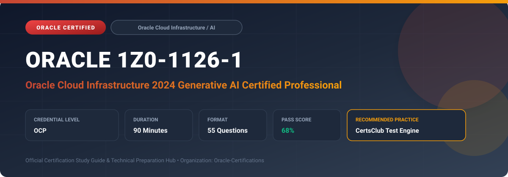

  

# Oracle 1Z0-1126-1: Oracle Cloud Infrastructure 2024 Generative AI Certified Professional

---

## 1. Exam Overview & Candidate Profile

The **Oracle 1Z0-1126-1: Oracle Cloud Infrastructure 2024 Generative AI Certified Professional** credential certifies AI practitioners capable of architecting, fine-tuning, and deploying generative AI solutions on OCI.

Candidates validate technical expertise in OCI Generative AI Service, Dedicated AI Clusters, pretrained models (Cohere Command, Llama), prompt engineering, fine-tuning techniques (T-Few), embeddings, and RAG pipelines.

### Target Audience & Prerequisites
- **Target Roles**: Implementation Specialists, Cloud Architects, Technical Leads, Enterprise Consultants, and Systems Engineers.
- **Recommended Experience**: 1–2 years of practical, hands-on experience designing, implementing, and maintaining corresponding Oracle solutions.
- **Credential Earned**: OCP Certification.

---

## 2. Key Exam Specifications

| Specification | Details |
| :--- | :--- |
| **Exam Code** | **Oracle 1Z0-1126-1** |
| **Official Title** | Oracle Cloud Infrastructure 2024 Generative AI Certified Professional |
| **Certification Track** | Oracle Cloud Infrastructure / AI |
| **Exam Duration** | 90 Minutes |
| **Number of Questions** | 55 Questions |
| **Passing Score** | 68% |
| **Question Format** | Multiple Choice (Single/Multiple Answer), Scenario-Based Questions |
| **Delivery Provider** | Oracle University / Pearson VUE (Online Proctored or Test Center) |
| **Recommended Practice Engine** | [CertsClub Oracle Practice Tests](https://www.certsclub.com/oracle/1z0-1126-1-dumps.html) |

---

## 3. Official Blueprint & Exam Domain Breakdown

The examination assesses candidate competencies across core functional domains weighted as follows:

| Domain Area | Weighting |
| :--- | :--- |
| **OCI Generative AI Architecture & LLM Foundations** | `25%` |
| **Dedicated AI Clusters for Training & Hosting** | `25%` |
| **Model Fine-Tuning & Parameter-Efficient Tuning (T-Few)** | `20%` |
| **Retrieval-Augmented Generation (RAG) & Vector Databases** | `20%` |
| **Security, Data Privacy & API Integration** | `10%` |

---

## 4. Deep Dive into Complex & Challenging Technical Topics

To secure a passing score on the 1Z0-1126-1 exam, candidates must master the following advanced concepts:

- Evaluating foundational LLM architectures: Cohere Command models, Cohere Embed models, and Meta Llama series.
- Configuring Dedicated AI Clusters: sizing GPU units for training versus hosting endpoints.
- Implementing Parameter-Efficient Fine-Tuning (PEFT) using T-Few to minimize weight updates and prevent catastrophic forgetting.
- Designing RAG systems using semantic vector search with OCI OpenSearch and Oracle Database 23ai AI Vector Search.
- Enforcing enterprise data privacy: ensuring customer prompts and responses remain strictly private to the tenancy.

---

## 5. Scenario-Based Demo & Practice Questions

### Question 1
What is the primary benefit of deploying an LLM endpoint on an OCI Dedicated AI Cluster rather than using the multi-tenant shared model endpoint?

A) Guaranteed predictable GPU throughput, dedicated compute isolation, and ability to host custom fine-tuned models
B) Completely free unlimited API calls
C) Automatic conversion of Python code into C++
D) Bypassing IAM authentication policies

- **Correct Answer**: `A) Guaranteed predictable GPU throughput, dedicated compute isolation, and ability to host custom fine-tuned models`  
- **Technical Explanation**: Dedicated AI Clusters allocate dedicated GPU hardware to your tenancy, ensuring strict compute isolation, predictable low-latency performance SLAs, and the ability to serve custom fine-tuned models.

---

### Question 2
Which vector distance metric is standard for normalized vector embeddings when evaluating semantic document similarity in OCI RAG applications?

A) Cosine Similarity
B) Manhattan Distance (L1)
C) Hamming Distance
D) Jaccard Index

- **Correct Answer**: `A) Cosine Similarity`  
- **Technical Explanation**: Cosine similarity measures the cosine of the angle between two high-dimensional embedding vectors, effectively capturing semantic orientation and similarity regardless of vector magnitude.

---

## 6. Recommended Preparation Strategy & Practice Testing Engine

Achieving certification in **Oracle 1Z0-1126-1** requires balanced theoretical study and scenario-based simulation practice:

1. **Review Oracle Documentation**: Master architecture guides, implementation workbooks, and administration manuals on the Oracle Help Center.
2. **Hands-on Lab Practice**: Execute real-world configuration, policy setup, and troubleshooting tasks in your cloud tenancy or test instance.
3. **Simulated Exam Drills**: Practice answering timed, scenario-based multiple-choice questions to familiarize yourself with the question formats, traps, and timing constraints.

### Practice With CertsClub
For realistic practice questions, updated dumps, and mock testing environments:
- **Resource**: [CertsClub Oracle Practice Test Engine](https://www.certsclub.com/oracle/1z0-1126-1-dumps.html)
- **Special Discount**: Use coupon code **`club20`** during checkout for an instant **20% discount** on all practice exam bundles and testing engines.

---

## 7. Official Documentation & References

- [Oracle University Certification Registry](https://education.oracle.com/)
- [Oracle Help Center Documentation Portal](https://docs.oracle.com/)
- [Oracle Cloud Infrastructure & Applications Guides](https://docs.oracle.com/en/cloud/)
- [CertsClub Oracle Certification Exam Practice](https://www.certsclub.com/oracle/1z0-1126-1-dumps.html)

---

## 8. SEO & Discovery Keywords

`oracle 1z0-1126-1, oracle 1z0-1126-1 exam, oracle 1z0-1126-1 dumps, 1Z0-1126-1 practice questions, 1Z0-1126-1 study guide, oracle cloud infrastructure 2024 generative ai certified professional, certsclub 1z0-1126-1`